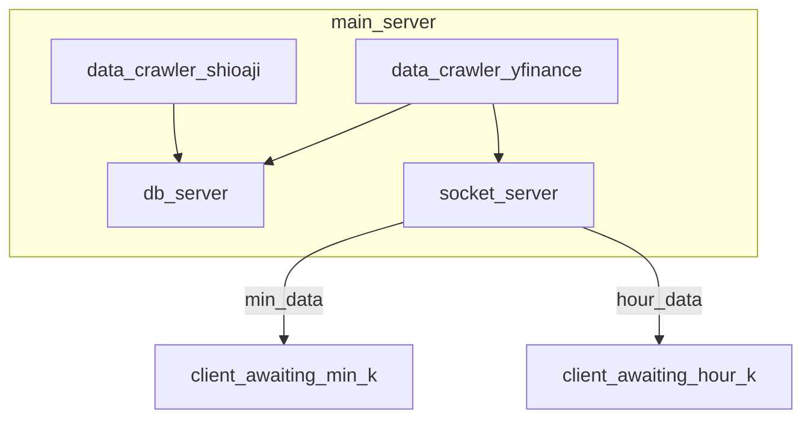

# data crawler

這個檔案focus 在data crawler 如何做


> x)基本上這個東西是一次性的，隨便做就好。
> 到了online階段，就不會隨便做就好了，報價一定要非常solid

麻煩的點在於data_source 到底要採取什麼樣的格式，這就是典型的資料庫問題。而到底要拿什麼資料，拿多少資料也和使用的algorithm 有高度相關


# source

* 資料源

  * twse 台灣證交所
    * 最權威
    * [【大盤、各產業類股及上市股票本益比、殖利率及股價淨值比】月報](https://www.twse.com.tw/zh/statistics/statisticsList?type=04&subType=220)
    * [個股日本益比、殖利率及股價淨值比（依日期查詢）](https://www.twse.com.tw/zh/page/trading/exchange/BWIBBU_d.html)
    * [OAS標準之API說明文件網址](https://openapi.twse.com.tw/v1/swagger.json)
      * 安裝swagger extension 直接render
      * 可以看到twse 的API 也完全不是用restful API，股票的各種應用特性很難符合restful API，response 甚至是csv 而非 html body
  * yahoo finance api
    * [Yahoo Finance API](https://www.yahoofinanceapi.com/)
      * 有swagger 
      * 根據[〈Free Stock Data for Python Using Yahoo Finance API〉](https://towardsdatascience.com/free-stock-data-for-python-using-yahoo-finance-api-9dafd96cad2e#:~:text=Rate Limitation,of 48%2C000 requests a day).)的說法，Yahoo Finance的API的限制為：Using the Public API (without authentication), you are  limited to 2,000 requests per hour per IP (or up to a total of 48,000  requests a day)。
        * 限制蠻麻煩的，台股約1116，hourly 就是最高限制了，
        * 可以算一下，minutely, 1116\*60=60000 per hour
        * 可能可以用換ip 破解
          * 電腦撥號
          * vpn
      * yfinance一次最多quote 10檔，1000檔也要100次
    * yfinance 
      * 而且短期大量query data之後應該是有限速，實測用yfinance acquire khour 也還是蠻慢的，整個台股，至少5min。如果可以找到kmin的source ，還不如每個小時用kmin的資料sum up
  * 群益API
    * [SKQuoteLib_RequestStocks的限制](https://www.capital.com.tw/Service2/download/API_BBSpage.asp?BBSID={6BF05CD6-B3E3-4039-B554-89D56FB09827})
      * max 200筆，即時報價
  * 元大one api
    * [券商API功能比較表 - GSnail](https://www.google.com/url?sa=t&rct=j&q=&esrc=s&source=web&cd=&cad=rja&uact=8&ved=2ahUKEwjVqN-8wunzAhXUy4sBHY83BMsQFnoECAMQAw&url=https%3A%2F%2Fgsnail.trade%2Fweb%2Fins%2Fapi_compare&usg=AOvVaw0ZMY8qv_yKIm-9nFLJZzEX)
      * 2000檔的訂閱應該是很夠了
    * 但是元大的API很多也很亂，要花一點時間確定訊息對不對

  * **永豐金 api** 

    * Tick 資料與 K 棒

    * > 台灣的金融業，api 基底可能都是.net 平台。 所以這個python 一樣也只能在windows，當然也可以用docker。

    * [永豐金證券程式交易 — Python API 準備 in Windows env.](https://medium.com/@jd7222/%E6%B0%B8%E8%B1%90%E8%AD%89%E5%88%B8%E6%A9%9F%E5%99%A8%E4%BA%BA-python-api-%E6%BA%96%E5%82%99-in-windows-env-d626cabe6b6e)

    * 由於目前台灣就永豐金的python api 做的最完善，接下來也要會其會準

    * 注意 api 有 [使用限制](https://sinotrade.github.io/tutor/limit/) >500times/5s 會被ban

      * 也就是1116檔，大約要10~15 s，勉強可接受

    * 分kbar 保留兩年，查兩年前的資料只會得到null data

  * **multicharts**

    * 台灣專業操盤者的標準，就算不用也要知道
    * 一般版月費大約1000，專業版要3000

  * yahoo finance

    * [使用Python及Yahoo Finance API抓取台股歷史資料](https://aronhack.com/retrieve-stock-historical-data-with-python-and-yahoo-finance-api/)

    * 分k只能抓到前30日的資料，1次7d max。

    * 5~30min k, 60d max, 

    * 60min~, 2y max,

    * 1d,,

    * 我過去資料，可能60min 或 1d的資料來比較好，可以從現在開始儲存分k

      * > 回憶過去大跌就會了解，分k 絕對是必要的

    * yahoo 的資料的volume 是成交股數而不是成交金額。用成交金額比較有通用性

      * 自己乘close 就好

  * googlefinance

    * 參考datasource

  * [grs ](https://github.com/toomore/grs) 

    * > grs 台灣上市上櫃股票價格擷取

  * [twstock](https://github.com/mlouielu/twstock)

  * [tsrtc](https://github.com/Asoul/tsrtc)

  * [tsec](https://github.com/Asoul/tsec)

  * **[FinMind](https://github.com/FinMind/FinMind)**

    * 現成的台股API，free user 有一點限制
    * 項目很多，可以搭配使用

## 開市資料

* [twse 市場開休市日期](https://www.twse.com.tw/zh/holidaySchedule/holidaySchedule)
  * 好像只有20年內的資料，而且要自己parsing 糟糕的表格，是用敘述表明是否交易，而非明確的代號
* 與其用那個爛東西，不如直接看拿到的資料是否有相關日期
* 還要考慮timezone, 日光時間等問題，所以比較時，最好用完整的datetime

# structure 推論

> 有沒有現成的？

我認為最好的模式就是像 永豐金 python api，有backend api server 從 db server 拿資料，負責回應query，並週期的query 資料。然後在python 裡面又有專門的lib 去call 這組query ，並整理成 python 裡的資料形式。

* 有要一個db server 是用檔案，操作和性能都比db server，而且所有project 都可以共用data。
  * db server 放在server 甚至同一臺機器，就不會被通訊限制
* backend server 
  * 讓one and only one 的agent 去modify 資料，並簡化長長的query。
    * 如果是python module access 了話，其實也會用module 把query 包掉，此時優勢就比不出來。
  * 如果是商業或安全考量要authority，這層也重要
  * **streaming**
    * 這是最重要的一點，可以主動送資料過來。且無可替代。但是已經有現成的API
* python lib
  * 額外的lib 基本是只是簡化操作，e.g. 每次都要把json 轉 pandas dataframe，不如一個專用的lib
  * e.g. 已經有yahoo finance api，還是有yfinance

> record, 或說帳務也是同一個道理，最好的case 就是像這樣堆起來
>
> 目前我backtest 用的 record 是直接backend server+python lib 有模組，然後模組用在 main code 裡，理應可以分拆

永api 已經做了這些，工作正常，為什麼還要研究？

問題就在外網通訊，backtest 和 training 時，一次需要大量資料。h5壓縮的2年份 時K台股資料是163MB，分K了話163/5\*5.5\*60~10.55GB。如果每次需要的時候再從外網donwload，那大部份時間都在下載。而且 training 和 backtest 在 deploy 時可能都是會每天至少跑一次的。如果local 有這個系統了話，再搭上10G網路，loading 的速度可以在10s左右。但是，如果是存在local 的pcie3x4 ssd 連續讀取大約可以在3s 內讀取完，最快的pcie4x4甚至可以在10.55/8~1.32 s 內就讀取完。當然這個問題如果可以piping reading+executing 了話完全可以解決，特別是training 的時候。但是在backtest就比較需要更改，比如一開始就要知道有那幾天是trade day，所以要一組專用api去從db 裡check，只傳 date series 回來。接下來是如果單次predict 的資料比較多，需要才下載會浪費太多時間，就要有額外的threading 專門下載並且block等待資料來 (GIL不會鎖IO 而是cpu)，（如果多到超過一次backtest時間，那一樣也會比只有backtest所需的時間還長）

也就是有三種環境

1. data at 外網
2. data at 內網
3. data at 本機

方案有

1. one file (stored data) + python lib(module)
2. db server + python lib(module)
3. db server+ backend server + python lib
   1. 後來發現，backend server 不只有 restful api，還有RPC
      1. [如何理解RPC和REST](https://zhuanlan.zhihu.com/p/34440779)
      2. RPC是雖然有server，但架構上看不到的，所以在程式設計架構上是等效option2，而不用考慮backend server的設計。
         1. 而且在LAN，不用考慮太多error state的問題，開銷也少
         2. grpc (proto)
         3. [Benchmarking — REST vs. gRPC](https://medium.com/sahibinden-technology/benchmarking-rest-vs-grpc-5d4b34360911)
            1. 其實rest性能也不差，兩者主要都是被網路限制。直接把rest當 method 應該也可以（for loop calling）

在最solid的回測下，一般是20年，10.55GB\*10~105.5GB，從節省的硬碟的角度來看不值，如果從1.32s -->13.2s 好像也還好，主要的關鍵可能反而是此時的memory 應該load 不下了（當然也可以8\*16G=128G server MB插滿）。所以必須採用streaming，one file 方案就不是很好了（當然也有像tensorflow 那樣的tfrecord，但是那個難度可能比db server 還高，要得到overview data 一樣是要額外的batching code，當然有不用create db的好處），當然 streaming 是最終需要但達到那個最終還很長。
data at 外網我覺得不用想太多，因為那怕是花大錢提升外網速度，100G+的流量也肯定會被盯上的。
方案2,3 的差異其實對於自己使用（非對外開放收費）沒什麼差別，節省的硬碟的錢並不重要，好幾個application 在方案2一樣可以共用db server，都用同一套python lib。如果內網有專用的db server，內網的所有本機一樣可以access(假設沒有人會亂搞)，一樣能省硬碟。
綜合以上，我認為方案2在內網或本機是最適合的。這個東西的目的不是要copy 出別人的api功能，再拿去提供給別人賣錢。而是在純依靠別人api 不可行之下，為了確保data source +程式的良好架構 而必須要做的功能。專業的model base 量化交易人不管花了多大的錢都應該有這個部份。

* > 至於real time 的 query 我覺得還是純用 券商api，因為資料量不大。

  * 更正，可能還是要用自己的，原因在於永api kbar query 限制，kbar 的query 一次只能query 一檔股票，且500/5s，台股有1k檔，所以要10s。這個情況可能還不如用yfinance。
  * 而且kbar 無法直接query mulit stock +時K+streaming 功能。只能說我認為直接用純api query 可行是正確的，但是手上的永API還不達標。

* [Python: How to Get Live Market Data (Less Than 0.1-Second Lag).](https://towardsdatascience.com/python-how-to-get-live-market-data-less-than-0-1-second-lag-c85ee280ed93)

  * yfinance polling 還算powerfull，可能query 還是以yfinance 為主
  * 要注意文中13:13 volume 的值還是0，我猜可能不是整單位13:15，所以還沒算出來?
    * 可能是5min 後一個trigger 會從分k 算總volume


* 分時日K的資料可能分開存比較好，像yfinance的週期不一，可能就是因為分開存

  * 壞處是更多硬碟，好處是資料不相關，比較不會連帶出錯
  * 如果之後有什麼發現再改回用分K算

* 錯過資料如何補齊

  * 資料庫掃描，有缺再query

* 如果連real time 都從self db抽資料，要如何確定已存入db。（目前原訂是直接從yfinance polling）

  * > 這個問題在 web 也討論過，終級辦法只有websocket

  * done signal

    * 比如一但update 就在某table 裡insert time stamp，然後trigger signal to stream
    * 比較正確的方法，比如是insert sucess 會回傳signal ，可是回傳signal 了話就會變成子程式（crawler+api）要由母程式（stock decision program）執行
      * **或是Interprocess Communication（IPC）** ，沒有這個限制
        * [asyncio Streams](https://docs.python.org/3/library/asyncio-stream.html#asyncio-streams)

  * 如果比分K大很多，那sum 起來如果有缺影響不大。但是分K（最小單位）就無法這樣做

  * 時間到就polling，直到有matching 的資料

  * 最好的可能還是引入方案3，在backend server 有 websocket 可以主動送資料。

  * > 如果不從DB 抽，有什麼方案？



# stream 技術

Python 的ipc

* [py39 Networking and Interprocess Communication](https://docs.python.org/3.9/library/ipc.html)
  * asyncio 取代asyncore, asyn
    * asyncio 的feature是，化簡用 socket 來做IPC  e.g. [**Streams**](https://docs.python.org/3.9/library/asyncio-stream.html#asyncio-streams)
      * [How can I broadcast asyncio StreamReader to several consumers?](https://stackoverflow.com/questions/61744721/how-can-i-broadcast-asyncio-streamreader-to-several-consumers)
      * aiohttp 是一個lib，一樣也有websocket
  * selectors 的底層是 select，用selector 就好
  * socket 是 ssl 和幾乎所有網路相關的底層 e.g. asyncio, selector
  * mmap
  * signal
  * [py36 18. Interprocess Communication and Networking — Python](https://www.google.com/url?sa=t&rct=j&q=&esrc=s&source=web&cd=&cad=rja&uact=8&ved=2ahUKEwj-xp-1ruPyAhV5yYsBHUjUBD8QFnoECAMQAQ&url=https%3A%2F%2Fdocs.python.org%2F3.6%2Flibrary%2Fipc.html&usg=AOvVaw1N36GAItpitMyaHlqrxjGH)
* [python repl communication_Python学习笔记（五）：Interprocess Communication](https://blog.csdn.net/weixin_39927623/article/details/111024913)
* [linux 进程间通信的3种高级方式及优缺点](https://www.cnblogs.com/lincappu/p/8536431.html)
* [Linux进程间通信：pipe、fifo、mmap、信号](https://www.huaweicloud.com/articles/13680574.html)
  * 管道(Pipes)
    * by os
    * 單向
  * 匿名管道(Anonymous pipes)
    * 單向 between process forked
  * 命名管道(Named pipes)
    * file in memory 
    * [python FIFO命名管道](https://blog.csdn.net/claroja/article/details/103489937)
  * 内存映射：mmap
    * 一樣要有血緣關係
    * 我不能分很清楚 named pipes 和 mmap
  * message 
    * 
  * 套接字(Sockets)
  * signal
* [ IPC: FIFO, mmap, or Unix Socket? ](https://arstechnica.com/civis/viewtopic.php?t=714224)

## socket

* [Python基於Socket實現簡易多人聊天室](https://iter01.com/562533.html)
  * 已經完成基本的broadcast
  * SOCK_DGRAM 是走UDP, SOCK_STREAM 是走TCP
  * 這樣子基乎是自己寫一個簡單的server，那直接用flask + websocket 有現成的框架會不會反而更快？因為目前看起來是如果要broadcast 不同的東西有兩種方法，一種是再開另外的socket，有幾種分K就開幾種socket。另外一種是server 有filter，而且能夠把對應的資料送給特定client。
    * 方法2比較好，但這就越來越接近websocket
* [Python TCP Server Accepting Connections and Broadcasting Commands](https://stackoverflow.com/questions/41785969/python-tcp-server-accepting-connections-and-broadcasting-commands)
  * 這個應該是TCP version的
  * tcp 不能直接對 socket 去send or receive, 要對connection

討論到這裡我覺得很明顯了，local backend server with websocket。雖然socket 就夠了，但用server+websocket的努力更少，擴充性更好。

# Asynchronous Web Frameworks server + websocket

* [ 2020年是时候更新你的技术武器库了:Asgi vs Wsgi(FastAPI vs Flask) ](https://juejin.cn/post/6854573215314870285)
* 


* [ Top 5 Asynchronous Web Frameworks for Python ](https://geekflare.com/python-asynchronous-web-frameworks/)
* aiohttp
  * [埋坑：aiohttp + Redis 打造簡易高效的 WebSocket Gateway (1)](https://lililala.medium.com/aiohttp-redis-%E6%89%93%E9%80%A0%E7%B0%A1%E6%98%93%E9%AB%98%E6%95%88%E7%9A%84-websocket-gateway-1-8c80fa786ac0)
  * [[Python爬蟲教學]整合asyncio與aiohttp打造Python非同步網頁爬蟲 ](https://www.learncodewithmike.com/2020/09/python-asynchronous-scraper-using-asyncio-and-aiohttp.html)
  * aiohttp 有server/ client 端，所以可以 fastAPI 當server，aiohttp當client
* **fastAPI**
  * 不是web 框架，而是 Web API 框架
  * 常常使用 aiohttp client
  * Starlette
    * [broadcaster](https://github.com/encode/broadcaster)
    * ASGI ，更新WSGI ，加入async 功能? 不太確定到底有什麼差
  * 常使用uvicorn當server


# structure

條件準備好了 [fastapi WebSockets](https://fastapi.tiangolo.com/advanced/websockets/)，目前只差如何把crawler 和 api server 整合。

> 其實兩者可以算獨立的program，可以看出api server的設計本來就不會考慮整合crawler。我之所以會想用1個process (甚至 1thread) ，是這已經完全足夠使用，之後要分也不難，最重要的是簡單（by signal）。

想錯 server 的功用了，完全無需整合，如果crawler 也是 server 的一個client (WebSocket Client)就好。

server 主管data input& output，所以crawler 的資料也是傳給server by API做儲存。至於broadcast的部份，可以基於`ConnectionManager` 1. 直接broadcast 資料給基它client，或是 2. crawler本身有一個專用的API，去notify `ConnectionManager` 去撈db並broadcast。後者理論上是一個更好的選擇，可以避免其它非 crawler client 傳送錯誤資料。

一堆不同API？GraphQL解決? 比如說只有要0050的股票或全部股票都要。但還要再加上graphQL 太累了，而且沒有明顯優勢，這次不弄了。

> 還存在odata 這種東西，基本上就是把sql 改成讓client寫，但我很懷疑如何控制權限，select * from users...
> 可能api真的sql query要自動加上 where id=my_id

要有什麼API？

* 從code_name 得到exchage id, 從exchange_id 和symbol 得到 stocks with id，從stocks id 加上start & end取得kbars（參考yfinance 和 永api）

  * ```python
    kbars = api.kbars_hr([Stocks("2330", "TPE"), Stocks("2409", "TPE")], start="2020-06-01", end="2020-07-01")
    ```

* websocket ，1hr 內的kbar 自動給出

  * ```python
    kbars= api.stream_kbars_hr([Stocks("2330", "TPE"), Stocks("2409", "TPE")] )
    ```

* 每1hr 蒐集資料給db

  * ```python
    api.create_kbars_hr([StockKHrCreate("2330", "TPE",230, 249...), StockKHrCreate("2409", "TPE", 13, 14...)])
    ```

* notify 每hr的websocket

  * ```
    api.notify_kbars_hr()
    ```

  * 只能有一個client，否則會亂notify

為了支撐上面，要有一些基本功能

* create exchange
* create stocks

到底應不應該為了特定api而做對應的db qeury function？答案是要，比例大約8:2，2成是一些基本的checking，比如該資料是否存在 ，checking 是 api router 的事， 不是 db query 的事。
等到要query 主要的一大串資料是就要專用 db query function (8成)，原因在於如果沒有一開始就減少拿到的資料，很多query資料量很可能是可以直接塞爆memory的，而且龐大的資料要送來backend server 這裡（可能不在同一個電腦），也是一個問題。

## restful

[透過網路交換資料的方式（SOAP 和RESTful API）](https://saffranblog.coderbridge.io/2021/02/06/soap-and-restful-api/)

比較麻煩的是如果api 很多就要寫很多不同query，而且create 1個和create 很多個的api 也不同，特別是restapi 其實並不支援bulk create > Although bulk operations (e.g. batch create) are essential in many  systems, they are not formally addressed by the RESTful architecture  style.。然而create kbars 本身就會同時需要 create 好幾個rows，所以這個功能又是必要的。

* [RESTful way to create multiple items in one request](https://stackoverflow.com/questions/411462/restful-way-to-create-multiple-items-in-one-request)

  * 有人認為 it's worth it to send 100 POST requests to the server. （當然不是mobile，且要local）
  * **直接把一整群視為單一資源** e.g. /orders --> /orders-collection，這是比較好的方法
  * 用 POST /orders，然後要用 transaction，而且要check 每一個元素是否valid
  * [facebook batch request](https://developers.facebook.com/docs/graph-api/batch-requests)
    * 這只是把個別的query 在json 裡分開然後一起送

* [Create Multiple Records | REST API Developer Guide](https://developer.salesforce.com/docs/atlas.en-us.api_rest.meta/api_rest/dome_composite_sobject_tree_flat.htm)

  * > ```bash
    > curl https://yourInstance.salesforce.com/services/data/v53.0/composite/tree/Account/ -H "Authorization: Bearer token -H "Content-Type: application/json" -d "@newrecords.json"
    > ```

    * composite 後面才是一般restful api url
    * url裡有compostie這一項

  * [REST Resources and Requests](https://developer.salesforce.com/docs/atlas.en-us.api_rest.meta/api_rest/intro_rest_resources.htm)

    * > ```url
      > https://MyDomainName.my.salesforce.com/services/data/vXX.X/resource/
      > ```

    * resource 就是一般restful api url, e.g. users, orders

* [閒聊- Web API 是否一定要RESTful? - 黑暗執行緒](https://blog.darkthread.net/blog/is-restful-required/)

這個是restful api 的example，可以看到resources 是一定要加s的，但get 是拿一整組，post，是指create一個

* [wiki 表現層狀態轉換](https://zh.wikipedia.org/zh-tw/%E8%A1%A8%E7%8E%B0%E5%B1%82%E7%8A%B6%E6%80%81%E8%BD%AC%E6%8D%A2#%E6%87%89%E7%94%A8%E6%96%BCWeb%E6%9C%8D%E5%8B%99)
* delete 沒有 response body
  * [RESTful - What should a DELETE response body contain](https://stackoverflow.com/questions/25970523/restful-what-should-a-delete-response-body-contain/50792918)

問題

* 同時get 太多資料，同時太多的kbars可能會讓memory （client or server）爆掉。通常是需要position 去取接下來的data。
  * pagination，現在先不管吧
  * [[QUESTION\] Querying large tables · Issue #1269 - GitHub](https://github.com/tiangolo/fastapi/issues/1269)
  * backtest可以避開e.g. ，新的週期，才 query 下次的N個data

### HATEOAS

* [RESTful web API 設計](https://docs.microsoft.com/zh-tw/azure/architecture/best-practices/api-design#use-hateoas-to-enable-navigation-to-related-resources)
  * 理論上 `/customers/1/orders/99/products` 符合 rest，但不建議。不要有超過一個數字，否則router一但要更動會有一堆問題
    * 最多使用到這裡，/stocks/2/stockKMins & /stocks/3/stockKHours
    * 然而，這個模式還是很複雜，最好使用單層 e.g. /stocks/2 就好，然後搭配hateoas 把 action 顯示出來是更好的做法。
* [REST HATEOAS教程(一)：HATEOAS入门](https://jozdoo.github.io/rest/2016/09/22/REST-HATEOAS.html)
  * restful api 其實應該是可以讓end user完全不知道url 是什麼的，直接call links 裡有開放的action
  * hateoas 中rel 就表示action
  * 比如 某 product 的 id為2，其屬於order with id 3，數量有4...。在links 裡直接有customer/5，表示這個order 是5號客人的，可以透過這個連到customer。

可是implement hateoas 不就代表 要有 (n-1) 個 links，才能和其它所有resource 連接，太累且不現實吧?

### filter by query parameter

get resources/ 基本上是一定會需要filter的

* [ REST API Design: Filtering, Sorting, and Pagination ](https://www.moesif.com/blog/technical/api-design/REST-API-Design-Filtering-Sorting-and-Pagination/)

  * ```api
    GET /items?state=active&seller_id=1234
    ```

    * 等效是 sellers/1234/items
    * 能否 item_id=... 取代 /time/{item_id}?

  * 著重 greater than, less than ... 的query 簡化

* [RESTFul API 最佳實踐| 想不起來而已](https://yingclin.github.io/2017/RESTFul-API-Best-Practice.html)

* [Query parameter list / multiple values   ](https://fastapi.tiangolo.com/tutorial/query-params-str-validations/#query-parameter-list-multiple-values)

  * query parameter 是一串 array 完全ok
  *  


